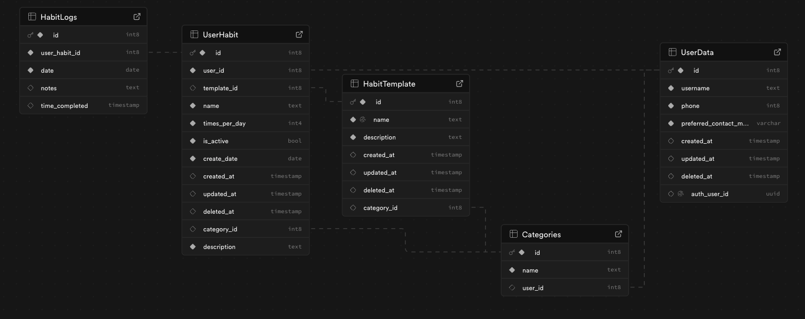
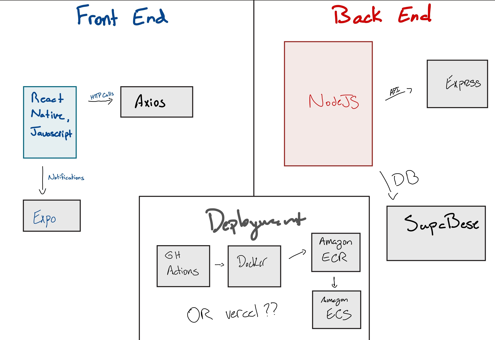

# HappyHabits

Repository for the HappyHabits app, an app to help you track your daily habits and get insights/set goals.

### Purpose

- Help users track their habits
- Help users build habits

### Methods

- Use Data Analysis tools and AI to help the user understand trends in their current habits
- Send notiifications to the user to prompt them when struggling or about to fail a task
- Celebrate the user for successes, encourage the user after failures

### ERD

### Tech Stack Diagram (work in progress)

# Project Schedule

|                    Deliverable                     | Projected Date | Finished Date |
| :------------------------------------------------: | :------------: | :-----------: |
|               Goals, WorkLog Set up                |   11/01 (F)    |     10/30     |
|             ERD and Project Pitch Done             |   11/03 (M)    |     11/03     |
|               System Design Complete               |   11/04 (T)    |     11/03     |
|        Behaviors / responsibilities planned        |   11/05 (W)    |     11/05     |
|                 Endpoints Planned                  |   11/06 (Th)   |     11/04     |
| frontend plans finalized, Notifications researched |   11/07 (F)    |     11/10     |
|      Frontend Interface Planned, hosting plan      |   11/08 (S)    |     11/10     |
|              build dummydata backend               |   11/10 (M)    |     null      |
|              working on react native               |   11/11 (T)    |     null      |
|             notifications basic setup              |   11/12 (W)    |     null      |
|                    app building                    |   11/13 (Th)   |     null      |
|                    app building                    |   11/14 (F)    |     null      |
|               app building, refining               |   11/15 (S)    |     null      |
|            notifications fully working             |   11/17 (M)    |     null      |
|         fully functioning, refining design         |   11/18 (T)    |     null      |
|              Host, Frontend Finished               |   11/19 (W)    |     null      |
|              backend plans finalized               |   11/20 (Th)   |     null      |
|                     db set up                      |   11/21 (F)    |     null      |
|                   hosting set up                   |   11/22 (S)    |     null      |
|                  endpoints built                   |   11/24 (M)    |     null      |
|                  backend finished                  |   11/25 (T)    |     null      |
|            adjustments or optimizations            |   11/26 (W)    |     null      |
|                       turkey                       |   11/27 (Th)   |     null      |
|       general review, consulting, user test        |   11/28 (F)    |     null      |
|                ! Project Finished !                |   11/29 (S)    |     null      |
|               Presentation Outlined                |   12/01 (M)    |     null      |
|               Presentation Prepared                |   12/02 (T)    |     null      |
|               Presentation Complete                |   12/03 (W)    |     null      |
|                     Get a job                      |   12/04 (Th)   |     null      |
|                     Get a job                      |   12/05 (F)    |     null      |
|                     Get a job                      |   12/06 (S)    |     null      |
|                     Get a job                      |   12/08 (M)    |     null      |
|                     Get a job                      |   12/09 (T)    |     null      |
|                     Get a job                      |   12/10 (W)    |     null      |
